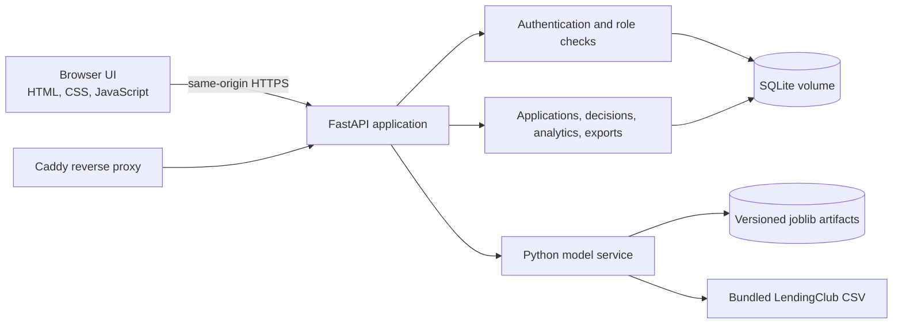

# CrediGuard AI

An open-source, self-hostable credit-risk decision-support demo. Applicants can submit a loan profile and view a probability estimate; analysts can review applications and record a human decision; administrators can manage access, risk bands, and model versions.

The app is intentionally presented as a **demonstration**, not a lender-ready underwriting system. Its model uses a small, single-month LendingClub sample and must not be the sole basis for a lending decision.

For a plain-language explanation of the application flow, backend, storage, model, and project files, see the [project guide](docs/PROJECT_GUIDE.md).

## What works

- Applicant registration, sign-in, private application status/history, requested-information resubmission, and persistent in-app notifications.
- Analyst queue with server-side search, risk/status filters, application detail, review transitions, and approve/reject/request-information decisions.
- Admin user access controls, configurable risk bands, model retraining, version history, and audit history.
- A real scikit-learn/XGBoost training pipeline, held-out metrics, local feature sensitivity display, and saved model artifacts.
- SQLite-backed applications, immutable prediction records, human decisions, recipient-scoped notifications, settings, and audit events.
- Per-application PDF reports, CSV exports for operational reports, and BI-ready CSV ingestion; current applications have no repayment outcome, so the export marks actual default as `NOT_OBSERVED`.
- Responsive browser UI, API documentation, health endpoint, Docker Compose, and a Caddy reverse proxy for HTTPS.

## Architecture



This is a small modular monolith: one Python service serves the API and UI, and keeps the model local. SQLite and local model files avoid requiring paid database or ML accounts. Caddy is the only public-facing container in Compose. The browser assets use system fonts and have no external analytics or CDN calls.

## Dataset audit

The supplied CSV is bundled at [`data/raw/accepted_2007_to_2018Q4.csv`](data/raw/accepted_2007_to_2018Q4.csv). The detailed audit and feature map are in [`docs/data-audit.md`](docs/data-audit.md).

| Finding | Supplied file |
|---|---:|
| Rows / columns | 1,022 / 151 |
| Issue-date coverage | December 2015 only |
| `Fully Paid` | 746 |
| `Charged Off` | 145 |
| Unresolved (`Current`, late, grace) | 131 |
| Resolved outcomes in whole file | 891 |
| Joint applications excluded from the one-applicant model | 8 |
| Completed individual loans used for training | 884 |
| Duplicate IDs / full rows | 0 / 0 |
| Individual defaults among completed training loans | 144 / 884 = 16.29% |

The model predicts `Charged Off` versus `Fully Paid` for individual applicants. Open/current or late loans are not treated as non-defaults; they are excluded because their final repayment outcome is unknown. The 8 joint applications are also excluded because co-applicant fields are sparse and the app's form represents one applicant. Training builds the metrics and artifacts from the bundled CSV at first startup. No score or feature importance is hard-coded into the UI.

## Model and evaluation

The reproducible pipeline compares Logistic Regression, Decision Tree, Random Forest, Support Vector Machine, and XGBoost. It uses a stratified train/validation/test split (random seed 42), selects by validation PR-AUC (ties by default recall and then ROC-AUC), tunes the selected family with a compact three-fold `RandomizedSearchCV`, then reports the selected model's metrics on a held-out test split.

Missing numeric values use a training median; categories use the training mode and one-hot encoding. Numeric fields are scaled in the common pipeline. Class weights or a tuned positive-class weight account for imbalance; no resampling or synthetic records are used. Outliers are not clipped or deleted. Training saves the model, the preprocessing pipeline, the feature ranges, and JSON metadata in the private instance volume.

The **test-set metrics are only evidence for this supplied sample**. All 1,022 rows have the same issue month, so temporal validation is impossible. A stratified random split cannot establish performance on a later year, another lender, or today's applicants. The small sample also makes metrics and feature rankings unstable. The model page shows actual validation and held-out results after training, including accuracy, precision, recall, F1, ROC-AUC, PR-AUC, and the test confusion matrix. The app reports the classifier's probability output; it has not been calibrated for real lending use.

Local explanation is a one-feature-at-a-time sensitivity check against training-profile medians/modes. It is **not SHAP**, is not additive, may be affected by correlated inputs, and does not establish causation. Global permutation importance is calculated on the held-out sample.

## Feature map

Only features present in the data and that an applicant can reasonably enter before a loan is priced are used for model input.

| Application input | LendingClub source | Transformation / use |
|---|---|---|
| Requested amount | `loan_amnt` | Numeric USD |
| Loan term | `term` | Extract 36 or 60 months |
| Annual income | `annual_inc` | Numeric USD |
| Home ownership | `home_ownership` | One-hot category (`MORTGAGE`, `RENT`, `OWN`) |
| Employment length | `emp_length` | One-hot category; missing values are mode-imputed |
| Loan purpose | `purpose` | One-hot category from the 11 observed values |
| Debt-to-income | `dti` | Numeric percentage |
| Prior delinquencies | `delinq_2yrs` | Numeric count |
| FICO score | `fico_range_low`, `fico_range_high` | Midpoint of the observed FICO band |
| Recent inquiries | `inq_last_6mths` | Numeric count |
| Open accounts | `open_acc` | Numeric count |
| Public records | `pub_rec` | Numeric count |
| Revolving balance | `revol_bal` | Numeric USD |
| Revolving utilization | `revol_util` | Numeric percentage |
| Total accounts | `total_acc` | Numeric count |

### Currency and regional settings

The bundled LendingClub features `loan_amnt`, `annual_inc`, and `revol_bal` are USD-denominated. The supported application market remains the United States, while applicants can enter monetary amounts in USD, INR, GBP, or EUR. For non-USD inputs, the backend obtains a dated daily reference rate from Frankfurter and converts loan amount, annual income, and revolving balance to USD before scoring. The original amounts and selected currency remain stored and displayed as entered. A quote ID is tied to the signed-in account, expires after eight hours, and its rate/source/date plus the exact normalized model amounts are saved with the prediction. If the rate service is unavailable, foreign-currency submissions stop with an actionable error; the system does not guess or silently reuse a stale rate. `FX_API_BASE_URL` can point to a compatible self-hosted Frankfurter instance.

This supports different monetary denominations only. It does not validate the US-trained model for India, the UK, Europe, or other credit markets, nor adjust for local credit systems, purchasing power, or lending rules. Those markets remain unavailable until separately supported by suitable training data and validation. Frankfurter is an open-source, free reference-rate API with no API key requirement ([official documentation](https://frankfurter.dev/)); its rates are daily reference rates, not a transaction quote.

Before entering financial values, an applicant confirms the application market and input currency, sees the dated USD conversion rate, and confirms the denomination again with the application. The application row stores `country_code` and `currency_code`; existing rows are migrated with `US` / `USD` defaults because the previous form and PDF treated all submitted values as USD. The migration does not change any amount. Account preferences separately store the display locale, which controls browser number and date formatting and can be changed without changing stored amounts or their currency.

The browser may suggest a display locale based on its language settings. That suggestion is only for formatting and is not treated as the applicant's location. The selected market describes the loan/model context; it is not proof of residence, nationality, identity, eligibility, or identity-verification jurisdiction. The interface remains English even when a different display locale is selected.

Portfolio averages are grouped by input `currency_code` and never combine different denominations. Application and BI CSVs include both entered amounts and the USD-normalized values used by the model, with quote metadata. API responses and PDFs retain the same conversion audit details. Documents, TrustCheck review, and expected-loss calculations are not implemented in this application.

The applicant form does not ask for fields absent from the model. The sample supports only the categories above; numeric inputs outside the model's training-split range receive a warning. Employment length is optional. Users enter demonstration credit-profile values; an actual lender would use authorized, verified sources.

## Risk score and decision workflow

- Probability of default is the model output, from 0 to 1. Prediction records retain the threshold snapshot used for their category, even if settings change later.
- Risk score is probability × 100.
- Default category bands start at 30% and 60% and can be changed by an administrator. These are illustrative defaults, not a calibrated policy.
- Prediction, risk score, category, and the analyst decision are separate records/concepts. A new prediction creates a new immutable record; past predictions remain available in history.
- An authorized analyst records `APPROVED`, `REJECTED`, or `NEEDS_MORE_INFORMATION`. Risk category never decides an application automatically.
- Applicants can view their own assessment and respond when the analyst requests information; they cannot view other accounts or model administration.

## Security and operational notes

- Passwords are stored with the standard-library `scrypt` password KDF; sessions are short-lived HS256-signed JWTs in HTTP-only, same-site cookies.
- Applicant and staff routes enforce roles on the server. Accounts can be disabled; audit events record important workflow and configuration actions.
- Same-origin deployment, security headers, request validation, and basic login/registration rate limits are enabled. CORS is not opened to arbitrary origins.
- First startup creates the administrator specified in environment variables, only if no administrator exists. The password is never printed. The default session secret is generated in the private data directory if one is not supplied.
- SQLite is appropriate for a single app instance and modest demo traffic. Run one app worker. For multi-instance or high-volume use, replace the persistence layer and add operational controls after a proper security review.
- The app has no email delivery, document upload, MFA, or automatic backup service. Back up the `app_data` Docker volume before maintenance.
- The demo CSV was provided by the project owner. Check its source terms before putting the dataset in a public repository or redistributing the built image.

## Run locally with Docker

Prerequisites: Docker Engine/Desktop with the Compose plugin.

1. Copy `.env.example` to `.env` and set a unique administrator password of at least 12 characters. Keep `.env` private.
2. Leave `APP_DOMAIN=http://localhost` for local HTTP access.
3. Start the app:

```powershell
docker compose up --build -d
docker compose ps
```

Open [http://localhost](http://localhost). Sign in using the bootstrap administrator email/password from `.env`. Applicant registration is enabled by default; the admin can promote an account to credit analyst.

The first start installs open-source Python packages and trains the model from the bundled CSV. This can take a few minutes. Follow startup progress with `docker compose logs -f app`. Health is available at `/api/health`; the local API reference is `/docs`.

Stop the containers with `docker compose down`. Application data stays in the named `app_data` volume. To remove it permanently, an operator must explicitly delete that Docker volume; that erases users, applications, audit events, and model history.

## Deploy for remote access

The software in this repository is freely available and open source. Public internet access still needs a reachable server and a domain name; a free, permanent hosting plan is not guaranteed by the software.

1. Use a Linux host with Docker/Compose, assign a DNS `A`/`AAAA` record for your domain to it, and allow inbound TCP ports 80 and 443.
2. Copy the project and the owner-supplied CSV to the host. Create `.env`, set `APP_DOMAIN=https://credit.example.com`, choose a unique bootstrap admin password, and leave `COOKIE_SECURE=auto`.
3. Run `docker compose up --build -d`. Caddy obtains and renews a trusted HTTPS certificate when the DNS record and ports are correct.
4. Open `https://credit.example.com`, sign in as the bootstrap admin, and provision analyst users.

Do not expose the app container's port directly; Compose only publishes Caddy's web ports. Use a restrictive host firewall, review server updates, and back up the Docker volumes. To run behind another TLS proxy, update the proxy setup and cookie settings deliberately.

## Run without Docker

Python 3.12 is recommended. In PowerShell:

```powershell
py -3.12 -m venv .venv
.\.venv\Scripts\Activate.ps1
python -m pip install -r requirements.txt
$env:BOOTSTRAP_ADMIN_EMAIL = "admin@example.test"
$env:BOOTSTRAP_ADMIN_PASSWORD = "set-a-unique-password-here"
$env:COOKIE_SECURE = "false"
python -m uvicorn app.main:app --host 127.0.0.1 --port 8000
```

Open [http://127.0.0.1:8000](http://127.0.0.1:8000). Runtime files are written under `instance/`, which is ignored by Git. On a public host, use Docker Compose/Caddy or a separately configured HTTPS reverse proxy; do not expose the development server directly to the internet.

## API overview

The local API reference at `/docs` reads endpoint definitions from FastAPI's OpenAPI schema at `/openapi.json`.

| Area | Endpoints |
|---|---|
| Health | `GET /api/health` |
| Regional configuration | `GET /api/config/regional`, `POST /api/currency-quotes`, `PUT /api/preferences/regional` |
| Authentication | `POST /api/auth/register`, `POST /api/auth/login`, `POST /api/auth/logout`, `GET /api/auth/me` |
| Applications | `GET/POST /api/applications`, `GET /api/applications/{id}` (includes prediction history), `POST /api/applications/{id}/predict`, `POST /api/applications/{id}/review`, `POST /api/applications/{id}/decision`, `PUT /api/applications/{id}/information` |
| Notifications | `GET /api/notifications`, `PATCH /api/notifications/{id}/read` (signed-in user's notifications only) |
| Dashboard | `GET /api/dashboard/summary` |
| Models | `GET /api/models/active`, `POST /api/models/retrain` (admin) |
| Configuration | `GET/PUT /api/config/risk` |
| Admin | `GET /api/users`, `PATCH /api/users/{id}/role`, `PATCH /api/users/{id}/active`, `GET /api/audit` |
| Reports | `GET /api/reports/applications/{id}.pdf`, `GET /api/reports/applications.csv`, `GET /api/reports/powerbi.csv` |

## Run lifecycle checks

With the project dependencies installed, run the focused workflow and privacy checks with:

```powershell
python -m unittest discover -s tests -v
```

The tests use a temporary SQLite database and stub the model response where needed; they do not touch the running application's Docker volume.

## BI-ready CSV

The `powerbi.csv` endpoint is accessible to analysts/admins and returns flattened application/prediction fields. It labels live records' actual repayment outcome as `NOT_OBSERVED`; the system has not observed repayment results for its new applications. Import the file into Power BI or another reporting tool and refresh it after exporting a new snapshot. The export is designed for analysis and is not a live connector.

## Open-source components

FastAPI, Uvicorn, Pydantic, pandas, NumPy, scikit-learn, XGBoost, joblib, ReportLab, SQLite, Python, and Caddy are open-source/free-to-use components. Their upstream licenses are retained by their respective projects. No paid external model API, cloud database, analytics SDK, or frontend CDN is required.
